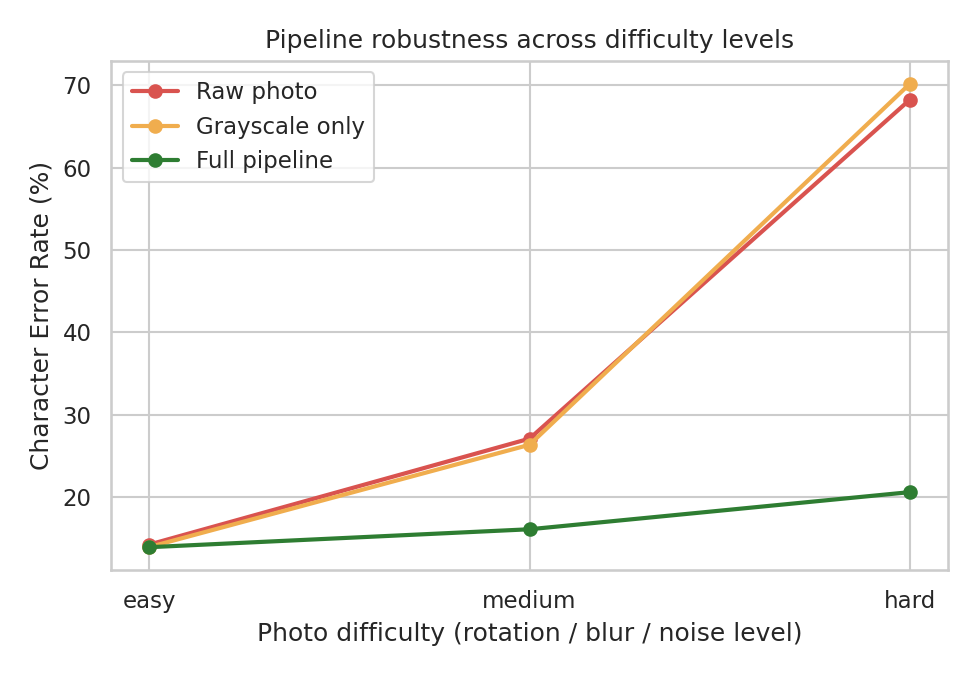
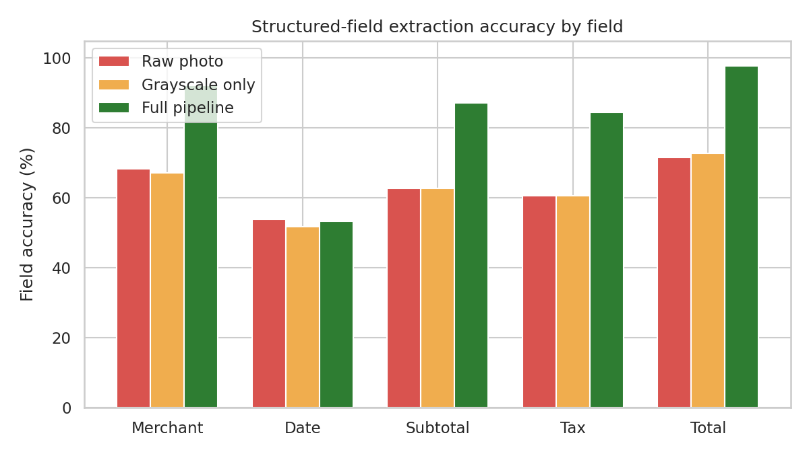
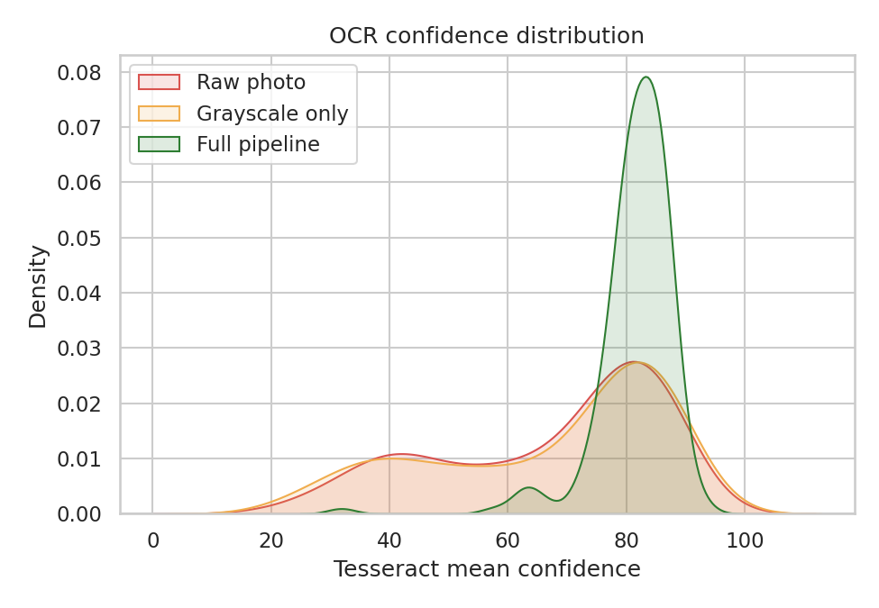
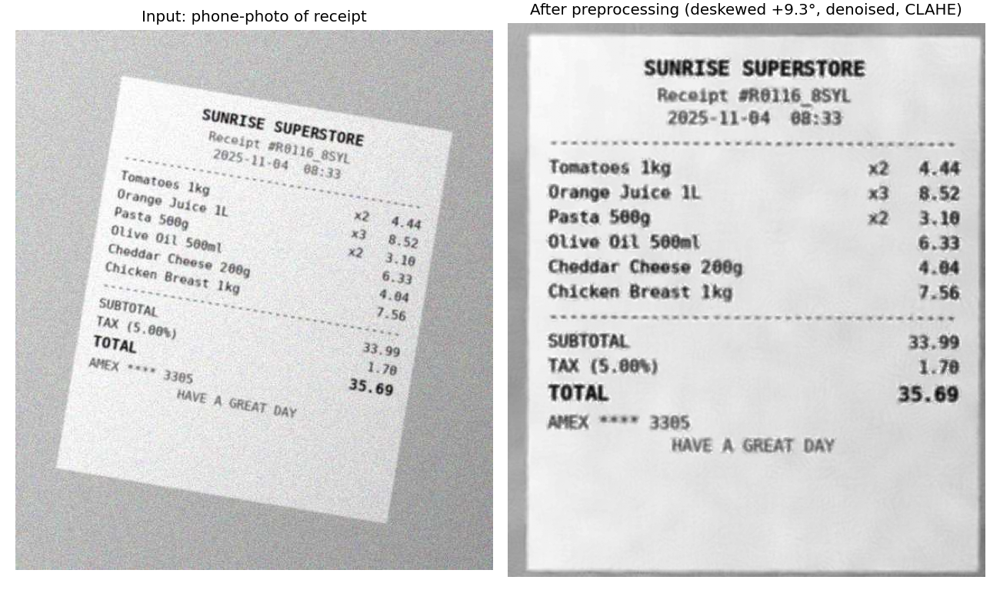
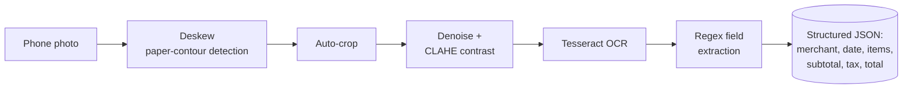

# 🧾 ReceiptIQ — Computer-Vision Receipt Digitization Pipeline

A classical computer-vision + OCR pipeline that turns noisy phone-camera
photos of receipts into structured, queryable data — with a measured,
reproducible accuracy improvement over doing no preprocessing at all.

No deep learning, no GPU, no external API keys, no downloaded datasets:
everything here runs offline with OpenCV, Tesseract, and scikit-learn/-image.

**[→ Try the interactive app](#-interactive-app)** · **[→ See the evaluation notebook](notebooks/pipeline_evaluation.ipynb)** · **[→ Jump to results](#-results)**

---

## Why this project

["Intelligent Document Processing"](https://en.wikipedia.org/wiki/Intelligent_document_processing) —
automatically turning photos of receipts, invoices, and forms into
structured data — is a real, funded problem: expense-management tools,
accounting software, and tax apps all need it. This project builds a
complete, honest version of that pipeline end to end:

1. **Generate** a labelled dataset (since real receipt-photo datasets are
   hard to license or download offline)
2. **Preprocess** noisy photos with classical CV (deskew, denoise, contrast
   enhancement)
3. **OCR** the result with Tesseract
4. **Extract** structured fields (merchant, date, subtotal, tax, total, line
   items) with rule-based parsing
5. **Evaluate** every stage against ground truth, quantifying exactly how
   much the CV preprocessing helps
6. **Serve** it as an interactive app

The [evaluation notebook](notebooks/pipeline_evaluation.ipynb) also documents
a real debugging story: an earlier version of the pipeline used adaptive
thresholding (the standard OCR preprocessing move) and it turned out to
*hurt* accuracy. The notebook shows how that was diagnosed and fixed.

## 📊 Results

Measured over **180 held-out synthetic receipts** spanning 3 difficulty
levels (`scripts/run_evaluation.py`, results cached in [`results/`](results/)):

| Condition | Character Error Rate | Field Accuracy | Item Recall | OCR Confidence |
|---|---:|---:|---:|---:|
| Raw photo (no preprocessing) | 36.5% | 63.4% | 73.3% | 67.2 |
| Grayscale only (naive baseline) | 36.8% | 63.0% | 73.6% | 67.2 |
| **Full pipeline** | **16.8%** | **83.0%** | **89.4%** | **81.5** |

**The preprocessing pipeline roughly halves the OCR error rate and lifts
structured-field accuracy by 20 points** — and the gap widens the most on
the hardest, blurriest, most rotated photos:



<details>
<summary>More charts (field-level accuracy, confidence distribution)</summary>




</details>

One field — `date` — stayed flat regardless of preprocessing (~53%), because
it's rendered in the smallest font on the receipt and a single-digit OCR
slip fails the exact-match metric. That's a genuine, documented limitation,
not a cherry-picked result — see [§7 of the notebook](notebooks/pipeline_evaluation.ipynb)
for the root-cause analysis.

### Before / after, on an actual "hard" difficulty sample



## 🖥️ Interactive app

```bash
streamlit run app/app.py
```

Upload your own receipt photo, or pick from the bundled sample gallery
(12 examples spanning every store category and difficulty level). The app
shows the cleaned-up image, OCR text, extracted structured fields side by
side with the "no preprocessing" baseline, and keeps a running expense
tracker across whatever you process in the session.

## 🏗️ How it works



- **Deskew**: finds the receipt's paper outline (one large, clean contour)
  and fits a rotated rectangle to it — more robust than fitting to sparse,
  disconnected text pixels when the photo is noisy.
- **Denoise + CLAHE**: `cv2.fastNlMeansDenoising` removes sensor noise while
  preserving text edges; adaptive histogram equalization fixes uneven
  lighting/shadows from the simulated "phone photo".
- **No binarization** — deliberately. See the [notebook](notebooks/pipeline_evaluation.ipynb) for why.
- **Extraction** uses regex + positional heuristics (e.g. "the last
  money-shaped token on a `TAX` line is the amount, not the rate in
  parentheses") rather than a trained model — transparent and needs no
  labelled training data.

## 📁 Project structure

```
receipt-intelligence-pipeline/
├── app/
│   └── app.py                    # Streamlit interactive demo
├── src/
│   ├── generate_receipts.py      # synthetic receipt + phone-photo generator
│   ├── preprocessing.py          # deskew / crop / denoise / CLAHE
│   ├── ocr.py                    # pytesseract wrapper
│   ├── extraction.py             # regex-based structured field extraction
│   └── metrics.py                # Levenshtein/CER + field-accuracy scoring
├── scripts/
│   ├── run_evaluation.py         # full dataset evaluation + chart generation
│   └── binarization_ablation.py  # the debugging-story benchmark
├── notebooks/
│   └── pipeline_evaluation.ipynb # narrated walkthrough with real outputs
├── tests/                        # 18 unit tests, stdlib unittest
├── data/                         # generated dataset (images + ground truth)
├── results/                      # cached metrics.json + charts
└── requirements.txt
```

## 🚀 Quickstart

```bash
git clone <your-fork-url>
cd receipt-intelligence-pipeline
pip install -r requirements.txt

# System dependency: Tesseract OCR
# macOS:           brew install tesseract
# Ubuntu/Debian:   sudo apt-get install tesseract-ocr
# Windows:         https://github.com/UB-Mannheim/tesseract/wiki

# (Optional) regenerate the dataset from scratch — a 180-receipt sample
# ships in data/ already, so this is only needed if you want a different
# size or seed.
python src/generate_receipts.py --n 180 --seed 42 --out data

# Run the full evaluation (takes a few minutes on CPU)
python scripts/run_evaluation.py

# Run the tests
python -m pytest tests/ -v

# Launch the app
streamlit run app/app.py
```

## 🧪 Tests & CI

18 unit tests (`tests/`) cover the metrics module (edit distance, CER, field
matching against known values), the regex extraction module (including a
regression test for the tax-line/percentage ambiguity bug), and the
preprocessing pipeline (rotation recovery against a known angle). GitHub
Actions (`.github/workflows/ci.yml`) runs the full suite on Python 3.10–3.12
on every push, plus an end-to-end smoke test of the whole pipeline.

## 🔭 Limitations & future work

- **Synthetic data**: results are on generated receipts, not real-world
  photos. The pipeline should be validated against a real dataset (e.g. the
  public [SROIE](https://rrc.cvc.uab.es/?ch=13) receipt dataset) before
  drawing conclusions about production performance.
- **Date field accuracy** (~53%) is the clearest remaining weakness — see
  the notebook's error analysis. A digit-confusion-aware post-processor or
  simply rendering timestamps at a larger font would likely help.
- **Rule-based extraction** is transparent and needs no training data, but
  a learned, layout-aware model (e.g. a fine-tuned LayoutLM-style
  transformer) would likely generalize better to receipt layouts this
  parser hasn't seen.
- **Tesseract** is a solid, dependency-light OCR engine, but a commercial
  OCR API or a fine-tuned CRNN would likely push the error rate down
  further, at the cost of the "runs fully offline" property this project
  optimized for.

## License

MIT — see [LICENSE](LICENSE).
